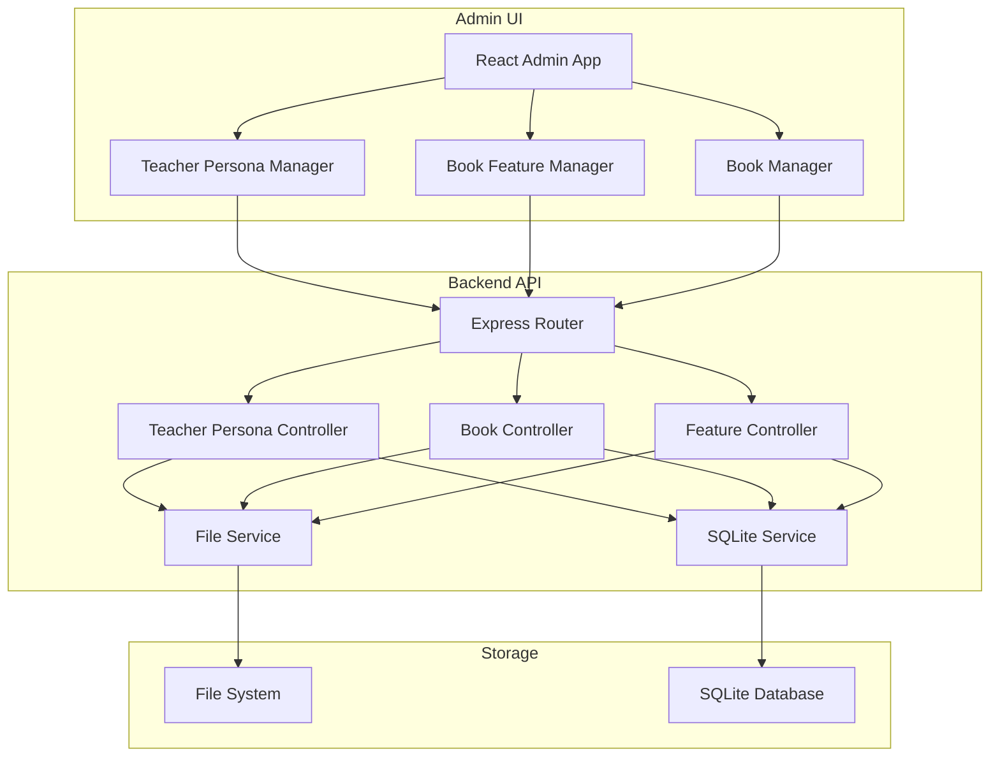

## DB Model

```dbml
Table teacher_personas {
  id integer [primary key, increment]
  grade text [not null]
  persona text [not null]
}

Table books {
  id integer [primary key, increment]
}

Table book_features {
  id integer [primary key, increment]
  book_id integer [ref: > books.id]
  subject text [not null]
  name text [not null]
  how_to_teach text [not null]
}
```


## Flow

